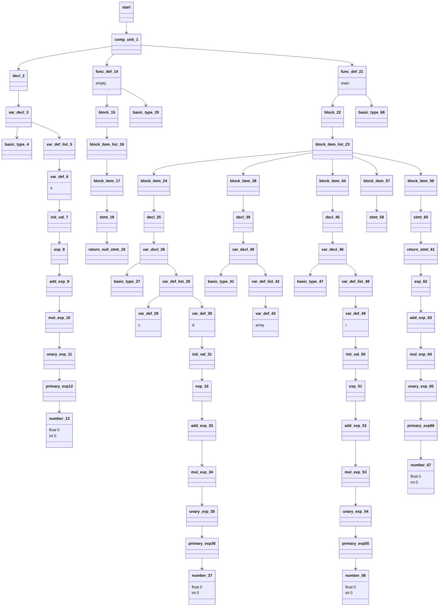

#### syntax_detail
###### describe attributes here

```mermaid
classDiagram
	start-->comp_unit_1
	comp_unit_1-->decl_2
	decl_2-->var_decl_3
	var_decl_3-->basic_type_4
	var_decl_3-->var_def_list_5
	var_def_list_5-->var_def_6
	var_def_6-->init_val_7
	init_val_7-->exp_8
	exp_8-->add_exp_9
	add_exp_9-->mul_exp_10
	mul_exp_10-->unary_exp_11
	unary_exp_11-->primary_exp12
	primary_exp12-->number_13
	number_13 : float 0
	number_13 : int 0
	var_def_6 : e
	comp_unit_1-->func_def_14
	func_def_14-->block_15
	block_15-->block_item_list_16
	block_item_list_16-->block_item_17
	block_item_17-->stmt_18
	stmt_18-->return_null_stmt_19
	func_def_14-->basic_type_20
	func_def_14 : empty
	comp_unit_1-->func_def_21
	func_def_21-->block_22
	block_22-->block_item_list_23
	block_item_list_23-->block_item_24
	block_item_24-->decl_25
	decl_25-->var_decl_26
	var_decl_26-->basic_type_27
	var_decl_26-->var_def_list_28
	var_def_list_28-->var_def_29
	var_def_29 : c
	var_def_list_28-->var_def_30
	var_def_30-->init_val_31
	init_val_31-->exp_32
	exp_32-->add_exp_33
	add_exp_33-->mul_exp_34
	mul_exp_34-->unary_exp_35
	unary_exp_35-->primary_exp36
	primary_exp36-->number_37
	number_37 : float 0
	number_37 : int 0
	var_def_30 : d
	block_item_list_23-->block_item_38
	block_item_38-->decl_39
	decl_39-->var_decl_40
	var_decl_40-->basic_type_41
	var_decl_40-->var_def_list_42
	var_def_list_42-->var_def_43
	var_def_43 : array
	block_item_list_23-->block_item_44
	block_item_44-->decl_45
	decl_45-->var_decl_46
	var_decl_46-->basic_type_47
	var_decl_46-->var_def_list_48
	var_def_list_48-->var_def_49
	var_def_49-->init_val_50
	init_val_50-->exp_51
	exp_51-->add_exp_52
	add_exp_52-->mul_exp_53
	mul_exp_53-->unary_exp_54
	unary_exp_54-->primary_exp55
	primary_exp55-->number_56
	number_56 : float 0
	number_56 : int 0
	var_def_49 : i
	block_item_list_23-->block_item_57
	block_item_57-->stmt_58
	block_item_list_23-->block_item_59
	block_item_59-->stmt_60
	stmt_60-->return_stmt_61
	return_stmt_61-->exp_62
	exp_62-->add_exp_63
	add_exp_63-->mul_exp_64
	mul_exp_64-->unary_exp_65
	unary_exp_65-->primary_exp66
	primary_exp66-->number_67
	number_67 : float 0
	number_67 : int 0
	func_def_21-->basic_type_68
	func_def_21 : main
```
#### result
###### give your description
------
