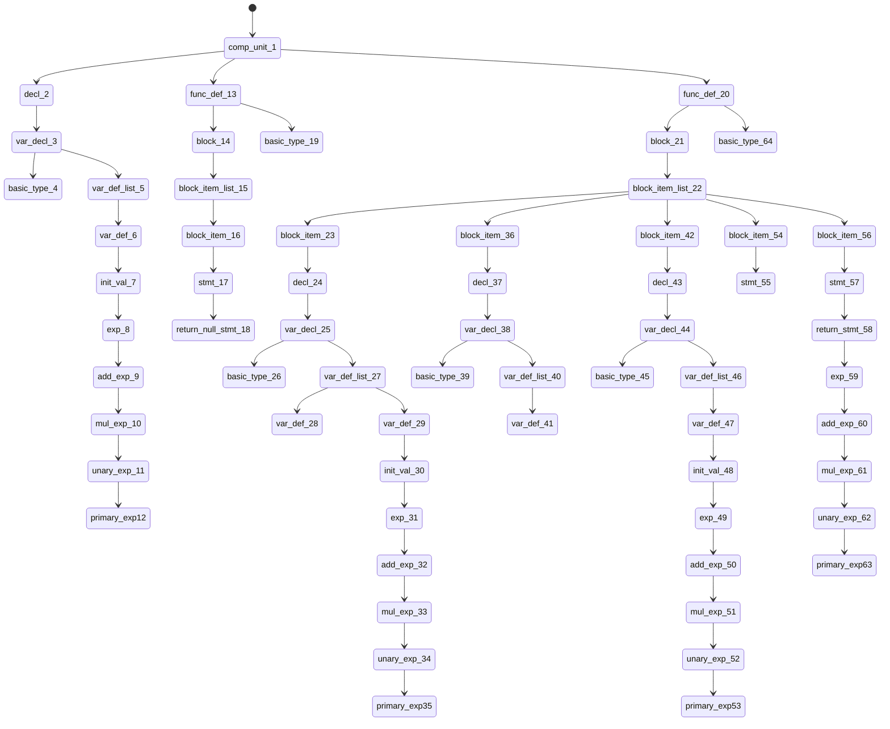

#### ZhuangTaiTu
###### describe attributes here

```mermaid
stateDiagram
	[*] --> comp_unit_1
	comp_unit_1 --> decl_2
	decl_2 --> var_decl_3
	var_decl_3 --> basic_type_4
	var_decl_3 --> var_def_list_5
	var_def_list_5 --> var_def_6
	var_def_6 --> init_val_7
	init_val_7 --> exp_8
	exp_8 --> add_exp_9
	add_exp_9 --> mul_exp_10
	mul_exp_10 --> unary_exp_11
	unary_exp_11 --> primary_exp12
	comp_unit_1 --> func_def_13
	func_def_13 --> block_14
	block_14 --> block_item_list_15
	block_item_list_15 --> block_item_16
	block_item_16 --> stmt_17
	stmt_17 --> return_null_stmt_18
	func_def_13 --> basic_type_19
	comp_unit_1 --> func_def_20
	func_def_20 --> block_21
	block_21 --> block_item_list_22
	block_item_list_22 --> block_item_23
	block_item_23 --> decl_24
	decl_24 --> var_decl_25
	var_decl_25 --> basic_type_26
	var_decl_25 --> var_def_list_27
	var_def_list_27 --> var_def_28
	var_def_list_27 --> var_def_29
	var_def_29 --> init_val_30
	init_val_30 --> exp_31
	exp_31 --> add_exp_32
	add_exp_32 --> mul_exp_33
	mul_exp_33 --> unary_exp_34
	unary_exp_34 --> primary_exp35
	block_item_list_22 --> block_item_36
	block_item_36 --> decl_37
	decl_37 --> var_decl_38
	var_decl_38 --> basic_type_39
	var_decl_38 --> var_def_list_40
	var_def_list_40 --> var_def_41
	block_item_list_22 --> block_item_42
	block_item_42 --> decl_43
	decl_43 --> var_decl_44
	var_decl_44 --> basic_type_45
	var_decl_44 --> var_def_list_46
	var_def_list_46 --> var_def_47
	var_def_47 --> init_val_48
	init_val_48 --> exp_49
	exp_49 --> add_exp_50
	add_exp_50 --> mul_exp_51
	mul_exp_51 --> unary_exp_52
	unary_exp_52 --> primary_exp53
	block_item_list_22 --> block_item_54
	block_item_54 --> stmt_55
	block_item_list_22 --> block_item_56
	block_item_56 --> stmt_57
	stmt_57 --> return_stmt_58
	return_stmt_58 --> exp_59
	exp_59 --> add_exp_60
	add_exp_60 --> mul_exp_61
	mul_exp_61 --> unary_exp_62
	unary_exp_62 --> primary_exp63
	func_def_20 --> basic_type_64
```
#### result
###### give your description
------
